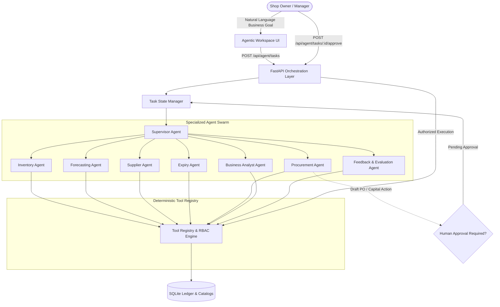

# StockMind AI: Enterprise Agentic Inventory Management System

> **An Agentic AI-Driven Multi-Agent Inventory Monitoring, Demand Forecasting, Replenishment, and Procurement Platform**  
> **Regional Specialization**: India (Tailored for Tamil Nadu & South Indian Retail Chains & Supermarkets)  
> **Currency & Format**: Indian Rupee (₹ / INR), Lakhs & Crores, Dual CGST/SGST Tax Accounting

---

## 🌟 Executive Overview

**StockMind AI** is a production-grade, goal-driven **Agentic AI Inventory Management System**. Unlike passive inventory databases or conventional chatbots that merely summarize static text, StockMind AI features an autonomous multi-agent swarm coordinated by an intelligent **Supervisor Agent**.

The system translates natural-language business directives into structured execution plans, coordinates specialized agents, invokes authorized database-grounded tools, enforces strict financial budgets and safety policies, and gates consequential capital allocations behind **Human-in-the-Loop (HITL)** approval controls.

Every calculation—from safety stock and economic reorder points to lead-time delivery analysis and purchase order cost ceilings—is computed deterministically from live database records. **No numbers, quantities, forecasts, or order details are ever fabricated.**

---

## 🏛️ Multi-Agent Architecture



### Specialized Agents & Roles

1. **Supervisor Agent (`backend/ai/agents/supervisor_agent.py`)**  
   Interprets unstructured business goals, extracts constraints (e.g., maximum budget, target days), decomposes goals into structured step sequences, assigns subtasks to specialized agents, enforces cross-agent consistency, and determines when human approval is required.
2. **Inventory Agent (`backend/ai/agents/inventory_agent.py`)**  
   Monitors live stock levels, calculates Average Daily Sales (ADS), Days of Inventory Remaining (DIR), and stockout runout windows.
3. **Forecasting Agent (`backend/ai/agents/forecasting_agent.py`)**  
   Evaluates historical sales velocity using a multi-model ML tournament (Weighted Moving Average, Multivariate Linear Regression, Random Forest Regressor), selects the champion model per SKU, and reports prediction intervals and uncertainty flags.
4. **Supplier Agent (`backend/ai/agents/supplier_agent.py`)**  
   Analyzes wholesale catalogs, evaluates unit pricing, minimum order quantities (MOQ), supplier delivery turnaround (lead times), and reliability metrics.
5. **Expiry Prevention Agent (`backend/ai/agents/expiry_agent.py`)**  
   Conducts First-Expired, First-Out (FEFO) batch audits. Recommends stock rotation and clearance markdowns for items nearing expiration. **Strict safety rule**: Expired stock (`days_to_expiry < 0`) is immediately quarantined for write-off/disposal and never recommended for sale.
6. **Procurement Agent (`backend/ai/agents/procurement_agent.py`)**  
   Synthesizes replenishment recommendations, negotiates supplier MOQs, applies strict budget limits (scaling orders down if capital is constrained), generates draft purchase orders, and requires human approval before committing financial orders.
7. **Business Analyst Agent (`backend/ai/agents/business_analyst_agent.py`)**  
   Audits gross margins, inventory turnover rates, working capital tied up in dead stock, and identifies slow-moving product categories.
8. **Feedback & Evaluation Agent (`backend/ai/agents/feedback_agent.py`)**  
   Compares past ML forecasts against actual point-of-sale consumption, logs Mean Absolute Errors (MAE), and tracks human acceptance/rejection rates of agent proposals.

---

## 🛠️ Tool Registry & Execution System

Every operation executes through a strictly validated, role-permissioned, and audited **Tool Registry** (`backend/ai/tool_registry.py` & `backend/ai/tools_catalog.py`). Tools validate input parameters with Pydantic schemas, verify authenticated caller roles, enforce idempotency keys, and log audit events.

| Tool Name | Category | Permissions | Description |
|---|---|---|---|
| `get_inventory` | Inventory | Cashier, Manager, Admin | Retrieves current stock levels, ADS, DIR, and stockout risk tiers. |
| `get_product_details` | Inventory | Cashier, Manager, Admin | Fetches individual SKU metadata, unit price, category, and reorder levels. |
| `get_sales_history` | Analytics | Cashier, Manager, Admin | Extracts chronological POS sales transactions for a product. |
| `forecast_demand` | Forecasting | Cashier, Manager, Admin | Runs ML demand forecasting models across 1-day, 7-day, or 30-day horizons. |
| `calculate_stockout_risk`| Inventory | Cashier, Manager, Admin | Evaluates stockout probability based on current stock, sales velocity, and lead time. |
| `calculate_reorder_quantity`| Replenishment| Manager, Admin | Computes statistical safety stock, lead-time demand, and target order quantity. |
| `identify_expiring_products`| Expiry | Cashier, Manager, Admin | FEFO audit of batches nearing expiration with runout estimates. |
| `identify_dead_stock` | Analytics | Manager, Admin | Identifies zero-movement inventory locking up retail working capital. |
| `get_supplier_options`| Suppliers | Manager, Admin | Lists authorized suppliers, wholesale prices, MOQs, and lead times. |
| `compare_suppliers` | Suppliers | Manager, Admin | Evaluates supplier trade-offs between urgent lead time vs. wholesale discount. |
| `calculate_purchase_budget`| Finance | Manager, Admin | Evaluates current purchase commitments against allocated capital limits. |
| `create_purchase_order_draft`| Procurement | Manager, Admin | Idempotently creates an unapproved draft purchase order in the database. |
| `validate_purchase_order`| Procurement | Manager, Admin | Verifies line items, quantities, supplier validity, and budget compliance. |
| `submit_approved_purchase_order`| Procurement | Manager, Admin (Gated) | Authorizes and commits an approved purchase order to the ledger. |
| `verify_purchase_order`| Procurement | Manager, Admin | Verifies the database status, line items, and audit trail of a purchase order. |
| `get_sales_analytics`| Analytics | Manager, Admin | Computes revenue, profit margins, turnover rates, and dead-stock capital. |
| `record_recommendation_feedback`| Evaluation | Manager, Admin | Logs feedback and outcome tracking for continuous agent refinement. |

---

## 🔒 Task State Persistence & Human-in-the-Loop (HITL)

Tasks progress through formal, persistent lifecycle states stored in SQLite (`agent_tasks`, `agent_task_steps`, `agent_task_approvals`, `agent_audit_logs`):

```
PENDING ──► PLANNING ──► RUNNING ──► WAITING_FOR_APPROVAL ──► COMPLETED
                             │                  │
                             ▼                  ▼
                           FAILED           CANCELLED / REJECTED
```

- **Autonomy Boundary**: Agents freely run read, forecasting, analytical, and draft-generation tools.
- **Approval Gateway**: When a draft purchase order or financial expenditure is proposed, the task immediately halts in `WAITING_FOR_APPROVAL`.
- **Pre-execution Verification**: Before committing an approved purchase order, the backend re-validates:
  1. The approval belongs to an authenticated user with `admin` or `manager` privileges.
  2. The task is currently in `WAITING_FOR_APPROVAL` state.
  3. The purchase order has not already been submitted (idempotency enforcement).
  4. Current inventory levels and supplier prices have not drifted to invalidate the plan.
  5. The final total remains strictly within the authorized budget limit.

---

## 💻 Agentic AI Dashboard Workspace

Navigate to `http://127.0.0.1:8000/#agent-workspace` to access the dedicated operations center:

1. **Agent Command Center**: Natural-language prompt console with one-click quick scenarios (7-Day Restock, ₹15,000 Budget Restock, Expiry Mitigation, Dead-Stock Liquidation).
2. **Live Execution Timeline**: Real-time event stream showing chronological step traces, sub-agent dispatches, and tool execution durations.
3. **Agent Status Panel**: Active task status badge (`RUNNING`, `WAITING_FOR_APPROVAL`, `COMPLETED`), current step indicator, and progress counters.
4. **Task Results & Plan Breakdown**: Tabular presentation of stockout risks, ML demand projections, supplier cost comparisons, and proposed restocking orders.
5. **Human Approval Center**: Interactive review cards displaying supplier, itemized products, quantities, budget impact, and one-click **Approve & Execute** or **Reject** actions.
6. **Task History & Audit Log**: Historical log of past autonomous tasks with execution durations and outcome states.

---

## 📡 REST API Reference

### Agent Task Management
- `POST /api/agent/tasks` — Launch an autonomous task from a natural-language goal or structured constraints.
- `GET /api/agent/tasks` — List task history filtered by status or date.
- `GET /api/agent/tasks/{task_id}` — Retrieve full task details, execution steps, tool results, and approval records.
- `POST /api/agent/tasks/{task_id}/approve` — Authorize a pending task and execute gated procurement actions.
- `POST /api/agent/tasks/{task_id}/reject` — Reject a pending proposal with an optional override reason.
- `POST /api/agent/tasks/{task_id}/cancel` — Cancel an in-progress or pending task.

### Tools & Observability
- `GET /api/agent/tools` — Discover registered tools, input schemas, and permission requirements.
- `POST /api/agent/tools/execute` — Execute an authorized tool directly in the backend.
- `GET /api/agent/audit-logs` — Query timestamped agent audit records.
- `GET /api/agent/metrics` — View task completion rates, average step durations, tool success rates, and budget compliance metrics.

---

## 🚀 Quickstart & Installation

### 1. Prerequisites
- Python 3.10+ (Python 3.11 recommended)
- Windows, macOS, or Linux

### 2. Environment Setup
```bash
# Clone and enter the workspace
cd "StockMind AI/agentic ai"

# Activate your virtual environment (example for Windows PowerShell)
..\.venv\Scripts\Activate.ps1

# Install dependencies
pip install -r requirements.txt
```

### 3. Initialize & Seed Database
The SQLite database (`inventory_ai.db`) is automatically migrated and seeded with 55+ Indian retail SKUs across 7 categories, 10 Tamil Nadu wholesale suppliers, and 180 days of historical sales:
```bash
python -m data.seed_data
```

### 4. (Optional) Configure Free Cloud LLM
StockMind AI features a **built-in deterministic offline engine** that handles multi-step goal planning, tool execution, and forecasting with zero external API dependencies.

To enable advanced natural-language reasoning with cloud LLMs:
1. Copy `.env.example` to `.env`:
   ```bash
   cp .env.example .env
   ```
2. Configure your preferred provider in `.env`:
   - **Google Gemini (Recommended & Free)**: Set `GEMINI_API_KEY=AIzaSy...` in `.env`
   - **Groq Cloud (Fast Llama-3.3)**: Set `GROQ_API_KEY=gsk_...` in `.env`
   - **Ollama (100% Local Offline)**: Run `ollama run llama3.2` and set `OLLAMA_BASE_URL=http://localhost:11434`

### 5. Start Application Server
```bash
python run_server.py
```
Open your browser and navigate to:
- **Web Application**: `http://127.0.0.1:8000`
- **Agentic AI Workspace**: `http://127.0.0.1:8000/#agent-workspace`
- **Interactive OpenAPI Docs**: `http://127.0.0.1:8000/docs`

---

## 👥 Default Demo Credentials

| Role | Username | Password | Permitted Actions |
|---|---|---|---|
| **Store Owner (Admin)** | `admin` | `admin123` | Full administrative control, task initiation, approvals, system configuration |
| **Store Manager** | `manager` | `manager123` | Task initiation, purchase approvals, stock audits, supplier management |
| **Cashier** | `cashier` | `cashier123` | POS terminal, sales lookup, read-only product and inventory queries |

---

## 🧪 Automated Testing & Verification

The project includes a comprehensive, 100% isolated test suite using `pytest`. The test runner creates a temporary, isolated SQLite replica for each test session, guaranteeing that production records in `inventory_ai.db` are never modified or corrupted.

### Run All Tests
```bash
& "..\.venv\Scripts\pytest.exe" -v
```

### Test Coverage Summary (26 of 26 Tests Passing)
- **End-to-End Acceptance Scenarios (`tests/test_agent_scenarios.py`)**:
  - `test_scenario_1_inventory_planning_3_days`: Verifies 3-day stockout runout detection, ML forecast generation, and replenishment quantity calculation.
  - `test_scenario_2_budget_constrained_procurement`: Verifies ₹10,000 budget cap enforcement and proportional order scaling.
  - `test_scenario_3_supplier_delivery_constraint`: Verifies lead-time analysis selecting fast suppliers during urgent runouts.
  - `test_scenario_4_expiry_prevention_and_markdown`: Verifies FEFO batch analysis, clearance discounts, and quarantine of expired stock.
  - `test_scenario_5_tool_failure_handling`: Verifies resilient handling and graceful error reporting when tools encounter missing inputs.
  - `test_scenario_6_approval_enforcement`: Verifies blocked execution when attempting to submit purchase orders without approval.
  - `test_scenario_7_result_verification`: Verifies post-execution database verification confirming draft PO creation.
- **Agentic Infrastructure & Security (`tests/test_agentic_system.py`)**:
  - `test_multi_agent_supervisor_execution`: Multi-agent supervisor workflow coordination.
  - `test_procurement_agent_budget_enforcement`: Strict budget ceiling scaling and verification.
  - `test_task_state_lifecycle_and_step_persistence`: State transitions and step persistence.
  - `test_tool_idempotency_prevention`: Duplicate tool execution prevention via cache keys.
  - `test_tool_registry_validation_and_authorization`: Pydantic schema validation and RBAC enforcement.
- **Core System Tests**:
  - `tests/test_agent_and_ai.py`: Observe-Analyze-Decide cycle, approval gateway, feedback loop.
  - `tests/test_inventory_ledger.py`: Atomic stock transactions and audit trail integrity.
  - `tests/test_pos_billing.py`: POS billing, dual GST calculation, customer returns.
  - `tests/test_forecasting_models.py`: Moving Average, Linear Regression, Random Forest.
  - `tests/test_reorder_and_suppliers.py`: Safety stock formula breakdown, dead stock, FEFO.
  - `tests/test_auth_and_roles.py`: PBKDF2 password hashing, JWT signatures, role enforcement.

---

## 💡 Example Prompts for the Agentic Workspace

Try these business prompts in the **Agent Command Center**:

1. **7-Day Restocking Plan**:
   > *"Prepare my shop for the next seven days. Prevent stockouts, avoid products expiring before sale, select reliable suppliers, and keep purchasing costs within ₹15,000."*
2. **Immediate 3-Day Shortage Response**:
   > *"Find products likely to run out within 3 days and generate an urgent replenishment plan."*
3. **Strict Budget Procurement**:
   > *"Prepare a restocking plan for critical dairy and grocery items strictly under ₹8,000."*
4. **FEFO Shelf-Life Audit**:
   > *"Identify batches nearing expiration, estimate unsold stock, and suggest clearance markdowns."*
5. **Capital Efficiency Audit**:
   > *"Analyze dead stock across all categories and recommend capital recovery actions."*
